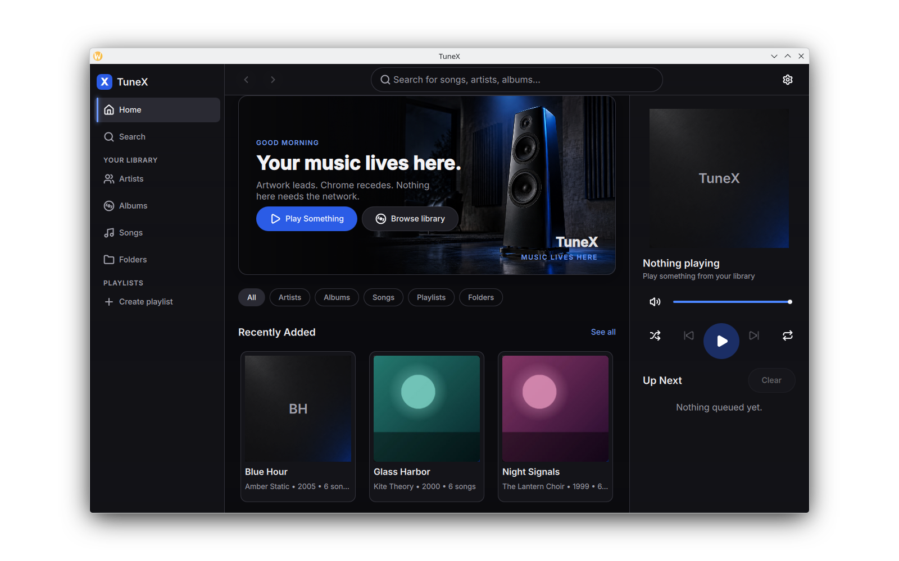

# TuneX

A local-first music player for Linux: a fast Rust engine (library index, GStreamer playback, SQLite/FTS5) wrapped in a GPU-accelerated Qt Quick dark-glass UI.

No accounts. No streaming. No network required for anything that matters.



## Features

- Point it at folders you own; it scans in the background and stays usable
- Browse artists, albums, and tracks with lazy artwork
- Instant FTS5 search across the library
- Gapless playback via GStreamer `playbin3`
- Queue, playlists, shuffle, and repeat
- MPRIS / media keys and desktop notifications
- Wayland-first, X11 compatible

Unknown metadata stays unknown. Missing art is a generated placeholder, never a guess.

## Build (Arch)

```bash
sudo pacman -S --needed qt6-base qt6-declarative qt6-shadertools cmake ninja rustup \
  gstreamer gst-plugins-base gst-plugins-good gst-plugins-bad gst-plugins-ugly \
  gst-libav sqlite pipewire pkgconf

rustup default stable

cmake -B build -G Ninja -DCMAKE_BUILD_TYPE=RelWithDebInfo
cmake --build build -j"$(nproc)"
./build/tunex
```

Rust quality gate: `rust-tc doctor` (or `just doctor`). QML: `scripts/qml-lint.sh` (Qt 6 tools only — on Arch the PATH `qmllint` is Qt 5).

## Packaging

The V1 artifact is an Arch PKGBUILD in `packaging/aur/`.

## License

[GPLv3](LICENSE) for the application. Qt is dynamically linked (LGPL). Lucide icon path data is ISC/MIT — see `LICENSES/Lucide.txt`.

## Docs

| File | What it is |
| --- | --- |
| `docs/SPEC.md` | Product spec |
| `docs/DESIGN.md` | Visual tokens (normative) |
| `docs/mockup.png` | Canonical layout reference |
| `AGENTS.md` | How this repo is developed |
